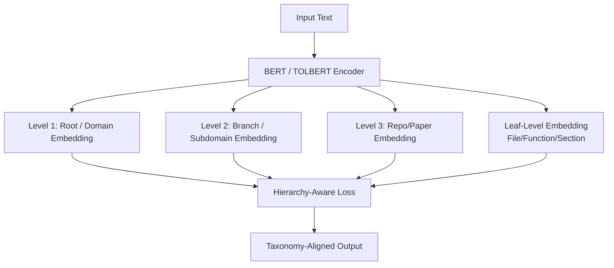

## Tree-of-Life BERT (TOLBERT)

Tree-of-Life BERT (TOLBERT) is a **hierarchical, ontology-structured variant of BERT** that uses a Tree-of-Life representation to model multi-level, evolutionary or taxonomic relationships over your universe of repositories and research papers.

For a quick orientation and links to the rest of the docs, see [`docs/index.md`](docs/index.md).

In classical BERT, tokens map into a **flat latent space** without any enforced ontological structure. In TOLBERT, the representations are constrained and regularized so that embeddings reflect **ancestral and branching relationships**—much like species diverging in an evolutionary tree. TOLBERT becomes the semantic encoder inside a **multi-level knowledge tree** rather than an unstructured space.

### What TOLBERT Enables

- **Multi-resolution embeddings**:
  - Root level: universal semantic space.
  - Intermediate branches: domain/family/subdomain representation.
  - Leaves: fine-grained repo/file/function or paper/section nodes.
- **Hierarchy-aware geometry**:
  - Distances in embedding space reflect **tree distance**.
  - Semantically close branches lie closer than distant ones.
- **Unified code + paper universe**:
  - Code (repos, files, functions) and papers (sections, paragraphs) share a Tree-of-Life.

TOLBERT is ideal for:

- Hierarchical text and code classification.
- Ontology embedding (e.g., RepoGraph, PaperGraph, biological ontologies).
- Repository and paper retrieval with structural priors.
- Multi-level reasoning over large knowledge graphs.

### Core Architectural Idea

Instead of a single flat representation, TOLBERT builds **multi-resolution embeddings** and predictions:

- The base encoder is a standard BERT/RoBERTa-like model.
- The `[CLS]` embedding is fed into **multi-level heads**, one per depth in the Tree-of-Life.
- Losses include:
  - Hierarchical cross-entropy (predict node at each level).
  - Path consistency loss (enforce ancestor-descendant coherence).
  - Tree-aware contrastive loss (geometry matches tree distance).

For a full architectural description and implementation sketch, see:

- `docs/overview.md`
- `docs/tree_of_life.md`
- `docs/architecture.md`
- `docs/training.md`
- `docs/usage.md`

### Conceptual Diagram

### Architecture

You can structure your entire software + research paper universe as a **Tree of Life of computation**:

- Root = universal programming/AI concepts.
- Branches = languages, frameworks, domains.
- Sub-branches = libraries, repos, subsystems.
- Leaves = individual functions, atoms of code, equations.

TOLBERT encodes meaning **relative to this ancestral lineage**, giving you multi-level semantic embeddings:

- Global similarity → repo similarity → module similarity → function/section similarity.

For detailed formal specification and derivations, see `design.md`. For implementation-ready guidance, see `docs/`.

### Reference datasets & helper scripts

This repo includes small, self-contained scripts for building span files and simple ontologies for the
reference benchmarks mentioned in the paper:

- CodeHierarchy:
  - `scripts/build_codehierarchy_spans.py`
  - Example config: `configs/codehierarchy_example.yaml`
- ResearchHierarchy (WOS-style 3-level taxonomy):
  - `scripts/build_wos_spans.py`
  - Generalized 3-level paper-side builder: `scripts/build_researchhierarchy_spans.py`
  - Example config: `configs/wos_example.yaml`
- ArXiv-CLS (2-level arXiv category hierarchy):
  - `scripts/build_arxiv_cls_spans.py`
  - Example config: `configs/arxiv_cls_example.yaml`

Each script produces a `spans_out` JSONL file with `node_path` annotations that can be plugged directly
into `scripts/train_tolbert.py` via the `spans_file` and `level_sizes` fields in your config.
